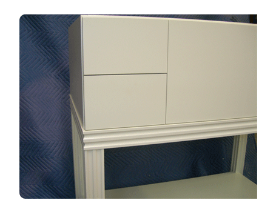
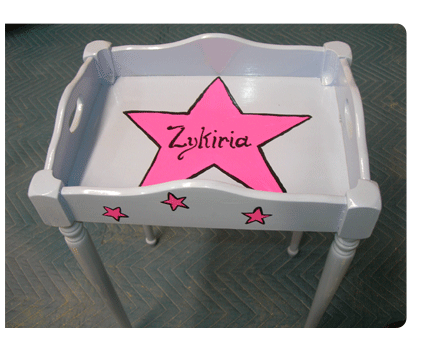

---
# Feel free to add content and custom Front Matter to this file.
# To modify the layout, see https://jekyllrb.com/docs/themes/#overriding-theme-defaults

layout: home
---

   

   

  

	
The Work of <a href="/david">David</a> and <a href="/amy">Amy Alley</a>

  		 

  		

		  
(click on name or image to enter)

  		

  
&nbsp;

  	

 	 
<a href="/david">David Alley</a>

     
<a href="/david">Custom Cabinetry</a>

  	 

     
<a href="/amy">Amy Alley</a>

     
<a href="/david">Re-Crafting</a>

